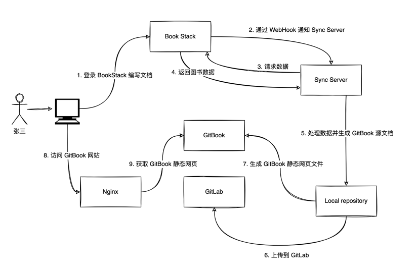

# BookStackExporter

Support export from BookStack to Markdown, HTML, PDF, TXT and GitBook.

# Download

 - `0.1.2`: [https://github.com/shensky711/BookStackExporter/releases/tag/0.1.2](https://github.com/shensky711/BookStackExporter/releases/tag/0.1.2)

# Usage

 1. unzip the archive:

```
unzip BookStackExporter-0.1.0.zip
```

 2. run command, eg:

```bash
./BookStackExporter-0.1.0/bin/BookStackExporter -o ./BookStack -t gitbook -baseUrl http://172.16.45.68:6875 -tokenId 6mmNKUPX4JtS2wxVBsPNjBWsdHoQXM8A -tokenSecret 587dWlqZ1lgvD6xjMGWo1cAVbAMltfgf -f
```

```bash
usage: BookStackExporter -baseUrl <arg> [-f] [-h] [-o <arg>] [-t <arg>] -tokenId <arg> -tokenSecret <arg>
 -baseUrl <arg>       Base url of BookStack
 -f,--force           Force overwrite
 -h,--help            Print help
 -o,--output <arg>    Export dir
 -t,--type <arg>      Export type, [gitbook|pdf|markdown|plaintext|html]
 -tokenId <arg>       This is a non-editable system generated identifier for this token which will need to be
                      provided in API requests.
 -tokenSecret <arg>   This is a system generated secret for this token which will need to be provided in API
                      requests. This will only be displayed this one time so copy this value to somewhere safe
                      and secure.
```

 - `-baseUrl`: Specify the address of your BookStack website
 - `-f`: Overwrite if specify output dir is exists
 - `-o`: Specify output dir
 - `-t`: Specify the file type, The options are the following: gitbook, pdf, markdown, plaintext, html
 - `-tokenId`: Can be obtained from the following ways: `Edit Profile` - `API Tokens` -  `Create API Token`
 - `-tokenSecret`: Can be obtained from the following ways: `Edit Profile` - `API Tokens` -  `Create API Token`


# Feature preview

BookStackExporter can start as a sync server, this is not a very general function. It can automatically sync the contents of BookStack to GitLab and GitBook. Try it yourself~ The following is the workflow:



```
./BookStackExporter-0.1.0/bin/BookStackExporter -syncServer -o ./BookStack -t gitbook -baseUrl http://172.16.45.68:6875 -tokenId 6mmNKUPX4JtS2wxVBsPNjBWsdHoQXM8A -tokenSecret 587dWlqZ1lgvD6xjMGWo1cAVbAMltfgf -webhookPort 6876 -gitlabToken d6TJxMXHr4byYQJG-Cy7 -gitbookName 我的图书 -gitbookDir ./GitBook -h
```
---

# License

Apache 2.0. See the [LICENSE](./LICENSE) file for details.
